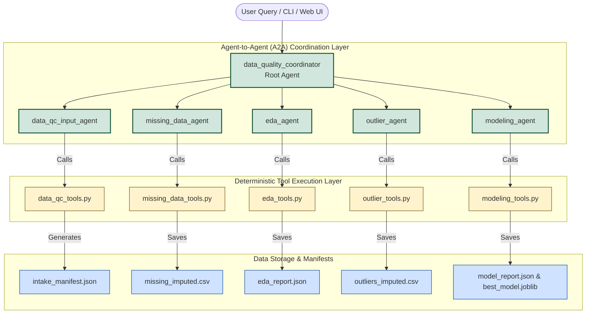
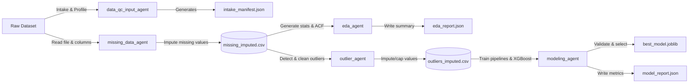

# OutlierAGeNT: End-to-End Tabular Data Quality & Modeling

OutlierAGeNT is a multi-agent framework designed to automate dataset profiling, missing-value imputation, exploratory data analysis (EDA), outlier handling, and machine learning model selection on tabular datasets. It combines **LLM-assisted planning** (via the Google Agent Development Kit - ADK) with **deterministic statistical tools** to ensure accuracy, transparency, and safety.

---

## 1. System Architecture (Agent-to-Agent / A2A)

The core architecture follows an **Agent-to-Agent (A2A) orchestration model**. A root coordinator agent acts as the brain, parsing user instructions and delegating specialized subtasks to independent, narrow-scope specialist agents. This modular division prevents LLM context bloat and ensures high-quality planning.

### Architecture Diagram



### Agent Roles & Specialist Capabilities

1. **`data_quality_coordinator` (Root Coordinator)**: The entry point. It understands natural language requests, determines the sequential workflow dependencies, and orchestrates execution by routing requests to correct specialists.
2. **`data_qc_input_agent` (Dataset Intake)**: Registers raw datasets, infers column schemas, matches or recommends target (Y) and feature (X) variables, and publishes a structured downstream manifest.
3. **`missing_data_agent` (Missing Data Specialist)**: Identifies missing entries and applies appropriate imputation strategies (e.g., median for numeric, mode for categorical, or row-dropping).
4. **`eda_agent` (EDA Specialist)**: Generates descriptive summaries, skewness, kurtosis, robust metrics, Pearson/Spearman correlations, and Autocorrelation (ACF) diagnostics.
5. **`outlier_agent` (Outlier Specialist)**: Detects anomalies using IQR, Z-score, or Modified Z-score methods, and cleans them using mean/median imputation, winsorization (capping), or row drop.
6. **`modeling_agent` (ML Specialist)**: Evaluates a shortlist of scikit-learn models (and XGBoost when available) using holdout cross-validation, selecting and exporting the highest-performing pipeline.

---

## 2. End-to-End Data Flow

Data flows sequentially between agents via structured file handoffs. Each agent updates the manifest and outputs a new state of the dataset, preventing downstream contamination.

### Data Flow Diagram



---

## 3. Execution Paths

The framework supports three operating modes:

### Path A: LLM-Driven Multi-Agent Execution (ADK)
Enables natural language team collaboration where agents autonomously call Python tools.
```powershell
# From the project root
adk run Google_ADK "Upload Forest Fire Smoke Dataset.xlsx, use fire_label as Y, and build a downstream plan"
```

### Path B: Deterministic Offline Pipeline (Batch mode)
Runs the identical underlying tools in a hardcoded pipeline without any LLM API requirements.
```powershell
python Google_ADK/run_offline_pipeline.py "Google_ADK/Forest Fire Smoke Dataset.xlsx" --target fire_label
```

### Path C: Single-File Outlier Specialist (Offline/LLM Hybrid)
A standalone CLI tool focused purely on tabular outliers (no modeling/missing-data features).
```powershell
# Run the local sensor demo
python Outlier_agent.py --no-llm --print-records
```

---

## 4. Setup & Installation

### Prerequisite Installation

```powershell
# Install core dependencies
pip install -r requirements.txt

# Install Google ADK specific dependencies
pip install -r Google_ADK/requirements.txt
```

### Environment Configuration
Copy the env templates and provide your API credentials:

```powershell
# Root special outlier agent env
Copy-Item .env.example .env

# Google ADK agent env
Copy-Item Google_ADK/.env.example Google_ADK/.env
```

Fill in `Google_ADK/.env` for Gemini model access:
```env
GOOGLE_API_KEY=your_gemini_api_key
GOOGLE_ADK_MODEL=gemini-2.0-flash
```

Or fill in `.env` for root OpenAI client access:
```env
OUTLIER_AGENT_API_KEY=your_openai_api_key
OUTLIER_AGENT_ENDPOINT=https://api.openai.com/v1
OUTLIER_AGENT_MODEL=gpt-4.1-mini
```
